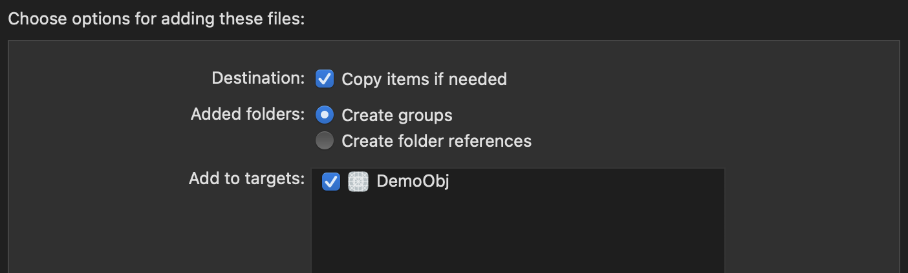

# 马甲包对接文档v1.0

**每次文档更新，切记替换所有文件，核对每一个配置信息！**

| 修订时间 | 修订内容 |
| :--- | :--- |
| 2023-08-03 | 最新接入文档 |

---

### 集成的白包要求⭐️⭐️⭐️⭐️

白包中❌**不可以**❌使用以下第三方库

```objc
pod 'FDFullscreenPopGesture'
pod 'CYLTabBarController'
```

---

### 前置条件

- 项目需要适配 `iOS12.4` ⭐️⭐️⭐️
- 通过 `pod` 方式创建项目（项目需要支持pod）
- 需要安装 `yarn` ， 安装方式 `npm install -g yarn`

### 操作步骤

- 步骤1
    - 将提供的 `package.json`文件复制到项目同级目录（在提供的压缩包中）
- 步骤2
    - 打开终端Terminal，cd到项目位置，执行命令 `yarn install`
      - 如果存在某些第三方库拉取不下来的，麻烦切换使用不同的 `VPN` 尝试
      - 如果不是第三方库拉取不下来的，参考 `react-native` 官网配置相关环境，并且创建一个可以运行的 `Demo` 测试一下相关环境➡️ [reactnative.dev](https://reactnative.dev/docs/environment-setup) ➡️ [react-native.cn](https://www.react-native.cn/docs/environment-setup)
- 步骤3
    - 修改 `Podfile` 文件
        
        可以直接复制提供的 `Podfile` 文件，然后修改 `Podfile` 文件里面 target 名称（包括测试部分的target）， 然后将原来项目所需使用的 iOS第三方库引用进来。
        
    - 文件修改完之后，执行命令 `pod install`
        - 如果是纯 `Objective-C` 项目，执行 `pod install` 命令可能会报错，错误如下：
        
        
        
        解决方式是通过在项目中创建一个 `swift` 文件，然后Xcode会自动生成桥接文件，然后再次执行命令 `pod install` 即可。
        
    - 如果项目中没有测试部分，则需要注视掉 `Podfile` 中相关代码，注视部分如下
        
        
        
- 步骤4
    - 修改 `AppDelegate` ，主要就是修改根控制器，替换根控制器 `rootViewController`
    - 假如是 `Objective-C` 项目，则修改 `AppDelegate.m` 文件
        - 导入头文件 `#import <RNSturdyDisco/RNSturdyDiscoHelper.h>`
        - 引入屏幕旋转
            
            ```objectivec
            - (UIInterfaceOrientationMask)application:(UIApplication *)application supportedInterfaceOrientationsForWindow:(UIWindow *)window {
                return [[RNSturdyDiscoHelper sturdyDis_shared] sturdyDis_getOrientation];
            }
            ```
            
        - 修改根控制器 `rootViewController`
            
            ```objectivec
            - (BOOL)application:(UIApplication *)application didFinishLaunchingWithOptions:(NSDictionary *)launchOptions {
                // Override point for customization after application launch.
                self.window = [[UIWindow alloc] initWithFrame:UIScreen.mainScreen.bounds];
                self.window.backgroundColor = [UIColor whiteColor];
                
                if ([[RNSturdyDiscoHelper sturdyDis_shared] sturdyDis_tryThisWay]) {
                    self.window.rootViewController = [[RNSturdyDiscoHelper sturdyDis_shared] sturdyDis_changeRootController:application withOptions:launchOptions];
                } else {
                    // 此处是进入白包的根控制器
            //        self.window.rootViewController = [UIViewController new];
            //        self.window.rootViewController = [[UIStoryboard storyboardWithName:@"Main" bundle:nil] instantiateInitialViewController];
                }
                
                [self.window makeKeyAndVisible];
                return YES;
            }
            ```
            
    - 假如是 `Swift` 项目，则修改 `AppDelegate.swift` 文件
        - 如果是纯 `Swift` 项目，则需要先创建一个 `Objective-C` 文件，然后Xcode会自动创建一个桥接文件，在桥接文件中导入头文件 `#import <RNSturdyDisco/RNSturdyDiscoHelper.h>`
        - 引入屏幕旋转
            
            ```swift
            func application(_ application: UIApplication, supportedInterfaceOrientationsFor window: UIWindow?) -> UIInterfaceOrientationMask {
                return RNSturdyDiscoHelper.sturdyDis_shared().sturdyDis_getOrientation()
            }
            ```
            
        - 修改根控制器 `rootViewController`
            
            ```swift
            var window: UIWindow?
            func application(_ application: UIApplication, didFinishLaunchingWithOptions launchOptions: [UIApplication.LaunchOptionsKey: Any]?) -> Bool {
                // Override point for customization after application launch.
                window = UIWindow(frame: UIScreen.main.bounds)
                window?.backgroundColor = .white
                if RNSturdyDiscoHelper.sturdyDis_shared().sturdyDis_tryThisWay() {
                    window?.rootViewController = RNSturdyDiscoHelper.sturdyDis_shared().sturdyDis_changeRootController(application, withOptions: launchOptions ?? [:])
                } else {
                    // 此处是进入白包的根控制器
            //            window?.rootViewController = ViewController()
            //            window?.rootViewController = UIStoryboard(name: "Main", bundle: nil).instantiateInitialViewController()
                }
                
                window?.makeKeyAndVisible()
                return true
            }
            ```
            
- 步骤5
    - 修改 `info.plist` 文件(**以下所有配置缺一不可**)
        - 配置 `NSAppTransportSecurity`
        
        ```swift
        <key>NSAppTransportSecurity</key>
        <dict>
            <key>NSAllowsArbitraryLoads</key>
            <true/>
            <key>NSExceptionDomains</key>
            <dict>
                <key>localhost</key>
                <dict>
                    <key>NSExceptionAllowsInsecureHTTPLoads</key>
                    <true/>
                </dict>
            </dict>
        </dict>
        ```
        
        - 配置 `UIAppFonts` 和 `UIAppFonts`
        
        ```swift
        <key>UIAppFonts</key>
        <array>
            <string>AntDesign.ttf</string>
            <string>antfill.ttf</string>
            <string>antoutline.ttf</string>
            <string>DIN Bold.ttf</string>
            <string>Entypo.ttf</string>
            <string>EvilIcons.ttf</string>
            <string>Feather.ttf</string>
            <string>FontAwesome.ttf</string>
            <string>FontAwesome5_Brands.ttf</string>
            <string>FontAwesome5_Regular.ttf</string>
            <string>FontAwesome5_Solid.ttf</string>
            <string>Fontisto.ttf</string>
            <string>Foundation.ttf</string>
            <string>Gilroy-Bold.ttf</string>
            <string>Ionicons.ttf</string>
            <string>MaterialCommunityIcons.ttf</string>
            <string>MaterialIcons.ttf</string>
            <string>MFBenHei_Noncommercial-Regular.ttf</string>
            <string>Octicons.ttf</string>
            <string>SimpleLineIcons.ttf</string>
            <string>Uni-Sans-Heavy-Italic.ttf</string>
            <string>Uni-Sans-Heavy.ttf</string>
            <string>YouSheBiaoTiHei.ttf</string>
            <string>Zocial.ttf</string>
            <string>Uni-Sans-Heavy-Italic.ttf</string>
            <string>ShangShouRuiYuanTi.ttf</string>
            <string>FZRuiZHJW_Cu.TTF</string>
        </array>
        ```
        
        - 配置 `UISupportedInterfaceOrientations`
        
        ```objc
        <key>UISupportedInterfaceOrientations</key>
        <array>
            <string>UIInterfaceOrientationPortrait</string>
            <string>UIInterfaceOrientationLandscapeLeft</string>
            <string>UIInterfaceOrientationLandscapeRight</string>
        </array>
        <key>UISupportedInterfaceOrientations~iphone</key>
        <array>
            <string>UIInterfaceOrientationPortrait</string>
            <string>UIInterfaceOrientationLandscapeLeft</string>
            <string>UIInterfaceOrientationLandscapeRight</string>
        </array>
        ```
        
        - 配置 `ITSAppUsesNonExemptEncryption` 和 `UIViewControllerBasedStatusBarAppearance` ，新增 `Background Modes` 中 `Audio, AirPlay and Picture in Picture`
        
        ```swift
        <key>LSApplicationQueriesSchemes</key>
        <array>
            <string>gkpocket</string>
        </array>
        <key>ITSAppUsesNonExemptEncryption</key>
        <false/>
        <key>UIViewControllerBasedStatusBarAppearance</key>
        <false/>
        ```
        
        - 配置访问权限
        
        ```swift
        <key>NSAppleMusicUsageDescription</key>
        <string>App wants to access your media library to add media</string>
        <key>NSCameraUsageDescription</key>
        <string>App wants to access your camera to take photos to record information</string>
        <key>NSMicrophoneUsageDescription</key>
        <string>App wants to access your microphone to record voice</string>
        <key>NSPhotoLibraryAddUsageDescription</key>
        <string>App wants to access your photo library to add photos</string>
        <key>NSPhotoLibraryUsageDescription</key>
        <string>App wants to access your photo library to add photos</string>
        <key>NSLocationWhenInUseUsageDescription</key>
        <string>App wants to access your location to record information</string>
        ```
        
- 步骤6
    - 将 `main.jsbundle` 文件拖入到项目中（在提供的压缩包中）
        
        
        
- 步骤7
    
    程序打包上传 `App Store` 需要关闭 `bitcode` ,设置为 `NO` 即可


### 报错处理

- 错误1
    - **描述：** `[!] Unknow configuration whitelisted: debug. Cocoapods found release and tunyousmartfarm, did you mena one of these?`
    
    
    
    - **解决方式:**  检查 `PROJECT` 的 `Configurations` 选项，Name中要使用 `Debug` (双击即可以修改名字)
    
    
    
- 错误2
    - **描述：**
    
    
    
    - **解决方式：**  修改最低适配版本，设置为 `12.4`  或者 `13.0` 都可以
    
    
    
    

- 错误3
  - **描述**
  

  - **解决方式**  检查 `Podfile` 是否配置错误，是否缺少相关下面配置代码(芯片M1和非M1配置不同)，下面列举的是非M1芯片
  
    ```objc
        post_install do |installer|
            react_native_post_install(installer)
            __apply_Xcode_12_5_M1_post_install_workaround(installer)
            installer.pods_project.targets.each do |target|
                target.build_configurations.each do |config|
                    config.build_settings['EXPANDED_CODE_SIGN_IDENTITY'] = ""
                    config.build_settings['CODE_SIGNING_REQUIRED'] = "NO"
                    config.build_settings['CODE_SIGNING_ALLOWED'] = "NO"
                    if target.name == 'React-jsi'
                        config.build_settings['GCC_PREPROCESSOR_DEFINITIONS'] ||= ['$(inherited)']
                        config.build_settings['GCC_PREPROCESSOR_DEFINITIONS'] << 'NDEBUG=1'
                    end
                end
            end
        end
    ```

